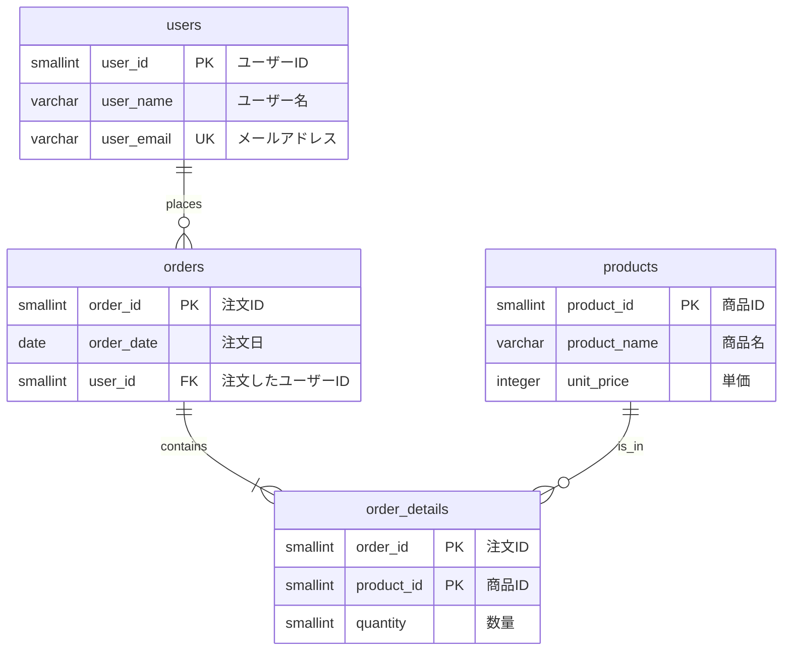

## 1.はじめに

こんにちは。前回の「設計編」に引き続き、リレーショナルデータベース（RDB）の学習記録です。
本記事では、実際に手を動かして AWS Aurora（PostgreSQL互換）上にデータベースを構築し、SQLを実行します。
https://zenn.dev/masaru0208/articles/d7ecc82124eda7

「頭で理解した設計思想が、実際のクエリでどう動くのか？」
この疑問を解消し、RDBを"武器"として扱えるようになることがゴールです。

## 2.対象読者

- リレーショナルデータベースを実際に触ってみたい方
- 「とりあえず動く」データベースから、保守性の高い設計へステップアップしたい方
- AWS上でのRDB構築に興味がある方

## 3.記事を読むメリット

- AWSマネジメントコンソールを用いたAurora構築の流れを把握できる
- DBeaverを使った接続方法と基本操作を習得できる
- SQLの基本（DDL/DML）を、前回学んだ正規化されたテーブル構造で実践できる

## 4.開発環境構築

本記事で使用する環境は以下の通りです。

### 4.1.使用ツール・サービス

| 項目 | 使用するもの | 用途 |
| --- | --- | --- |
| データベース | Amazon Aurora (PostgreSQL互換) | クラウド上のRDB |
| クライアントツール | DBeaver Community Edition | DBへの接続・SQL実行 |
| OS | Windows 11 | 開発マシン |

### 4.2.DBeaverとは

https://dbeaver.io/

- DBeaverは、無料で利用できるデータベース管理ツール（GUIクライアント）です
- MySQL、PostgreSQL、Oracle、SQL Serverなど、ほとんどの主要なデータベースに対応
- ER図（テーブル間のリレーション図）を自動生成できます

#### 類似ツール

無償で全機能利用可能という点でDBeaverを選定したが、以下のような類似ツールもあります。

- TablePlus: https://tableplus.com/
- Beekeeper Studio: https://www.beekeeperstudio.io/ja/
- HeidiSQL: https://www.heidisql.com/
- DbGate: https://www.dbgate.io/ja/
- DataGrip: https://www.jetbrains.com/ja-jp/datagrip/

## 5.AWS Aurora (PostgreSQL互換) の構築

### 5.1.なぜAuroraを選ぶのか

設計編でも触れましたが、AWS環境でRDBを使うなら **Amazon Aurora** が推奨されます。

| 観点 | Aurora のメリット |
| --- | --- |
| パフォーマンス | MySQL/PostgreSQLの数倍の処理速度 |
| 可用性 | 自動フェイルオーバー、複数AZへのレプリケーション |
| 運用負荷 | 自動バックアップ、パッチ適用はAWSが管理 |
| スケーラビリティ | Aurora Serverless v2で負荷に応じた自動スケーリング |

今回は学習目的のため、コストを抑えた構成で構築します。

### 5.2.VPCとセキュリティグループの準備

Auroraを構築する前に、ネットワーク周りの設定を確認します。

#### 5.2.1.セキュリティグループの作成

1. AWSマネジメントコンソールで「VPC」を検索し、VPCダッシュボードを開く
2. 左メニューから「セキュリティグループ」を選択
3. 「セキュリティグループを作成」をクリック
4. 以下を設定：

| 項目 | 設定値 |
|---|---|
| セキュリティグループ名 | `aurora-postgres-sg` |
| 説明 | `Security group for Aurora PostgreSQL` |
| VPC | デフォルトVPCまたは作成済みのVPC |

5. インバウンドルールを追加：

| タイプ | ポート範囲 | ソース |
|---|---|---|
| PostgreSQL | 5432 | [自身のIPアドレス](https://www.cman.jp/network/support/go_access.cgi) |

### 5.3.Auroraクラスターの作成

1. AWSマネジメントコンソールで「RDS」を検索し、RDSダッシュボードを開く
2. 「データベースの作成」をクリック
3. 以下の設定で作成：

#### 5.3.1.エンジンの選択

| 項目 | 設定値 |
|---|---|
| エンジンのタイプ | Aurora (PostgreSQL Compatible) |
| エンジンバージョン | 最新の安定版（例：Aurora PostgreSQL メジャーバージョンのデフォルト 17） |

#### 5.3.2.テンプレート

| 項目 | 設定値 |
|---|---|
| テンプレート | 開発/テスト（コスト削減のため） |

#### 5.3.3.設定

| 項目 | 設定値 |
|---|---|
| DBクラスター識別子 | `my-learning-aurora`等 |
| ユーザー名 | `postgres`（デフォルト） |
| 認証情報管理 | AWS Secrets Manager |

#### 5.3.4.接続

| 項目 | 設定値 |
|---|---|
| コンピューティングリソース | 接続しない |
| VPC | 先ほどセキュリティグループを作成したVPC |
| パブリックアクセス | あり（学習用。本番環境では「いいえ」推奨） |
| VPCセキュリティグループ | 先ほど作成した`aurora-postgres-sg` |

1. 「データベースの作成」をクリック

作成完了まで数分かかります。ステータスが「利用可能」になるまで待ちましょう。

### 5.4.エンドポイントの確認

Auroraクラスターが作成されたら、接続に必要な情報を確認します。

1. RDSダッシュボードで作成したクラスターを選択
2. 「接続とセキュリティ」タブを開く
3. 「エンドポイント」をクリックしエンドポイントセクションから **ライターエンドポイント** をコピー

例：`my-learning-aurora.cluster-xxxxxxxxxxxx.ap-northeast-1.rds.amazonaws.com`

## 6.DBeaverからAuroraへの接続

### 6.1.接続設定

1. DBeaverを起動
2. 左上の「新しい接続」アイコン（プラグマーク）をクリック
3. 「PostgreSQL」を選択し「次へ」をクリック
4. 以下を参照し接続情報を入力：

接続とセキュリティタブにて確認

| 項目 | 設定値 |
|---|---|
| Connect by | Host |
| Host | タイプ：ライターのエンドポイント |
| Port | 5432 |
| Database | postgres |
| 認証 | Database Native |
| Username | postgres（作成時に設定したマスターユーザー名） |
| Password | RDSダッシュボードから"シークレットマネージャー"と記載されたボタンをクリックし取得 |

1. 「テスト接続」をクリックし、接続が成功することを確認
2. 「完了」をクリック

### 6.2.接続できない場合のトラブルシューティング

| 症状 | 確認ポイント |
|---|---|
| タイムアウトする | セキュリティグループのインバウンドIP、VPCのルートテーブル等が正しく設定されているか |

ここでちょっとはまりました

## 7.SQL実践：データベース・テーブルの作成

ここからは、設計編で正規化した「注文管理システム」のテーブルを実際に作成していきます。

### 7.1.テーブルの作成

- テーブル構造は簡単な受発注システムを想定したものとしています。
- ここではGUIベースに作成していきたいと思います



#### 7.1.1.usersテーブル

- ユーザーテーブル`users`を作成します
- postgres > データベース > postgres > スキーマ > public > テーブル > 右クリック > 新しく作る表をクリック


- テーブル名を`users`に設定し、列セクションで右クリックし"新しく作る カラム"をクリックし、`user_id`, `user_name`, `user_email`を追加します。
  - `user_id`では身元をBy Defaultに、keyを主キーに設定
  - `user_email`ではkeyをユニークキーに設定

`Ctrl+S`で保存することで、最終的に以下のようなSQLを使用しテーブル作成が実行されます

```sql
CREATE TABLE public.users (
    user_id smallint GENERATED BY DEFAULT AS IDENTITY NOT NULL,
    user_name varchar NOT NULL,
    user_email varchar NOT NULL,
    CONSTRAINT users_pk PRIMARY KEY (user_id),
    CONSTRAINT users_unique UNIQUE (user_email)
);
```


:::details 列作成のプロパティについて

https://dbeaver.com/docs/dbeaver/25.3/Creating-columns/#create

| 項目名                           | 説明                                                                                      |
| -------------------------------- | ----------------------------------------------------------------------------------------- |
| 身元 | Identityの日本語訳。いわゆるサロゲートキーのようなデータ追加時に自動的にインクリメントした番号を割り振る機能
| Collection                       | データソートする際の基準を示すもの。仮に日本語基準でソートをする予定があればここを`ja_JP` |
| Storage                          | データの圧縮方式らしいが公式ドキュメントではこの項目を確認できなかった。基本は空でよい。  |
| key | user_idやemail等、一意であることが重要な場合はチェックを入れます。生成されるNameは列名とは異なり制御ロジックの中で使用される名称なので自動生成されるものを利用でよさそうです                                                                                          |
:::


#### 7.1.2.productsテーブル

- 商品テーブル`products`を作成します。
- このテーブルでは`unit_price`項目に制約を追加します。
- セクションを制約に切り替え > 右クリック > 新しく作る制約をクリック
- タイプを`CHECK`に変更し以下のように入力します


最終的に以下のSQLが実行されます

```sql
CREATE TABLE public.products (
	product_id smallint GENERATED BY DEFAULT AS IDENTITY NOT NULL,
	product_name varchar NOT NULL,
	unit_price integer NOT NULL,
	CONSTRAINT products_pk PRIMARY KEY (product_id),
	CONSTRAINT products_check_ge_zero CHECK (unit_price >= 0)
);
```

#### 7.1.3.ordersテーブル

- 注文テーブル`orders`を作成します。
- このテーブルでは`user_id`項目に外部キー設定を追加します
- セクションを外部キーに切り替え > 右クリック > 新しく作る外部キーをクリック
- usersのuser_idとordersのuser_idが紐づくように以下のように設定します。また、ON DELETEとON UPDATEの動作を定義します。


:::details 外部キーの制約について

https://dbeaver.com/docs/dbeaver/25.3/Utilizing-Foreign-Keys/#create

|項目|説明|
|---|---|
|CASCADE|親テーブルの行が削除された場合、子テーブルの関連する行も自動的に削除されます。|
|RESTRICT|親テーブルの行を削除しようとしたときに、子テーブルに関連する行が存在する場合、削除操作は拒否されます。|
|NO ACTION|RESTRICTと同様に、関連する行が存在する場合は削除操作を拒否しますが、標準SQLの動作では、制約チェックがトランザクションの最後に行われる点が異なります。|
|SET NULL|親テーブルの行が削除された場合、子テーブルの関連する外部キー列の値をNULLに設定します。|
|SET DEFAULT|親テーブルの行が削除された場合、子テーブルの関連する外部キー列の値をデフォルト値に設定します。|

:::

最終的に以下のSQLが実行されます

```sql
CREATE TABLE public.orders (
	order_id smallint GENERATED BY DEFAULT AS IDENTITY NOT NULL,
	order_date date NOT NULL,
	user_id smallint NOT NULL,
	CONSTRAINT orders_pk PRIMARY KEY (order_id),
	CONSTRAINT user_id FOREIGN KEY (user_id) REFERENCES public.users(user_id) ON DELETE RESTRICT ON UPDATE CASCADE
);
```

#### 7.1.4.order_detailsテーブル

- 注文明細テーブル（交差テーブル）`order_details`テーブルを作成します。
- `order_id`と`product_id`をプライマリーキーかつ外部キーに設定します
- `quantity`には 0より大きい 制約を設けます

最終的に以下のSQLが実行されます

```sql
CREATE TABLE public.order_details (
	order_id smallint NOT NULL,
	product_id smallint NOT NULL,
	quantity smallint NOT NULL,
	CONSTRAINT order_details_pk PRIMARY KEY (order_id,product_id),
	CONSTRAINT order_details_check CHECK (quantity > 0),
	CONSTRAINT order_id FOREIGN KEY (order_id) REFERENCES public.orders(order_id) ON DELETE RESTRICT ON UPDATE CASCADE,
	CONSTRAINT product_id FOREIGN KEY (product_id) REFERENCES public.products(product_id) ON DELETE RESTRICT ON UPDATE CASCADE
);
```


### 7.2.ER図の確認

DBeaverでは、作成したテーブルのER図（Entity-Relationship図）を自動生成できます。

1. 左のデータベースナビゲータで `テーブル` を右クリック > `View Diagram`をクリック
2. リレーションが線で結ばれた図が表示され、設計通りの正規化構造が視覚的に確認できます。


:::details ローカルだけで完結させるなら

## DBeaverを使ったローカル環境での開発方法

### Mockデータ構築

- WSL2, DockerDesktopをインストールしておく
- BE用プロジェクトフォルダを作成する
- `docker-compose.yml` を作成し以下を記載

```yml
version: "3.9"

services:
  postgres:
    image: postgres:16
    container_name: postgres-local
    ports:
      - "5432:5432"
    environment:
      POSTGRES_DB: sample_db
      POSTGRES_USER: sample_user
      POSTGRES_PASSWORD: sample_pass
      TZ: Asia/Tokyo
    volumes:
      - pgdata:/var/lib/postgresql/data
    restart: unless-stopped

volumes:
  pgdata:
```

- PowerShellやコマンドプロンプトで`docker compose up -d`コマンドを実行


- `docker ps`でデータ確認するかDockerDesktopの画面で以下のような情報が確認できればOK


- DBeaverを起動し、新しい接続 > PostgreSQlを選択


- `docker-compose.yml`の設定を参照し接続情報を入力


| 項目 | 設定値 |
| --- | --- |
| Host | localhost |
| Port | 5432 |
| Database | sample_db |
| Username | sample_user |
| Password | sample_pass |

- テスト接続をクリック
- ”ドライバファイルをダウンロードする”が出現した場合はダウンロード


- 接続テストの完了を確認し、新しい接続のウィンドウで”終了”をクリック


- 作成したデータベース上で右クリックし `SQLエディタ` > `SQLエディタ`をクリック


- ヘルプ から `Create sample database` をクリックし、サンプルデータベースを作成

:::


## 8.SQL実践：データの投入

### 8.1.データの挿入（DML）

テーブルにサンプルデータを投入します。

```sql
-- ユーザーデータの挿入
INSERT INTO users (user_id, user_name, user_email) VALUES
    ('u_001', '田中太郎', 'tanaka@example.com'),
    ('u_002', '佐藤花子', 'sato@example.com'),
    ('u_003', '鈴木一郎', 'suzuki@example.com');

-- 商品データの挿入
INSERT INTO products (product_id, product_name, unit_price) VALUES
    ('A', 'りんご', 100),
    ('B', 'みかん', 50),
    ('C', 'バナナ', 200),
    ('D', 'ぶどう', 300);

-- 注文データの挿入
INSERT INTO orders (order_id, order_date, user_id) VALUES
    ('001', '2025-01-01', 'u_001'),
    ('002', '2025-01-02', 'u_002'),
    ('003', '2025-01-03', 'u_001');

-- 注文明細データの挿入
INSERT INTO order_details (order_id, product_id, quantity) VALUES
    ('001', 'A', 2),
    ('001', 'B', 5),
    ('002', 'C', 1),
    ('003', 'A', 3),
    ('003', 'D', 2);
```

:::message
**DML（Data Manipulation Language）とは？**
データの「操作」を行うためのSQL文です。`INSERT`、`UPDATE`、`DELETE`、`SELECT`などが該当します。
:::

### 8.2.データの確認

投入したデータを確認してみましょう。

```sql
-- 各テーブルの全データを取得
SELECT * FROM users;
SELECT * FROM products;
SELECT * FROM orders;
SELECT * FROM order_details;
```

## 9.SQL実践：データの検索

### 9.1.基本的なSELECT文

```sql
-- 特定のカラムのみ取得
SELECT user_name, user_email FROM users;

-- 条件付き検索（WHERE句）
SELECT * FROM products WHERE unit_price >= 100;

-- 並び替え（ORDER BY句）
SELECT * FROM products ORDER BY unit_price DESC;
```

### 9.2.テーブルの結合（JOIN）

正規化されたテーブルの真価は、JOINによる結合で発揮されます。

```sql
-- 注文一覧に「ユーザー名」を付与して表示
SELECT 
    o.order_id,
    o.order_date,
    u.user_name,
    u.user_email
FROM orders o
INNER JOIN users u ON o.user_id = u.user_id;
```

```sql
-- 注文明細に「商品名」「単価」を付与し、小計を計算
SELECT 
    od.order_id,
    p.product_name,
    p.unit_price,
    od.quantity,
    p.unit_price * od.quantity AS subtotal
FROM order_details od
INNER JOIN products p ON od.product_id = p.product_id;
```

```sql
-- 注文ごとの合計金額を算出
SELECT 
    o.order_id,
    o.order_date,
    u.user_name,
    SUM(p.unit_price * od.quantity) AS total_amount
FROM orders o
INNER JOIN users u ON o.user_id = u.user_id
INNER JOIN order_details od ON o.order_id = od.order_id
INNER JOIN products p ON od.product_id = p.product_id
GROUP BY o.order_id, o.order_date, u.user_name
ORDER BY o.order_id;
```

### 9.3.JOINの種類

| JOIN種類 | 説明 |
|---|---|
| INNER JOIN | 両方のテーブルに一致するデータのみ取得 |
| LEFT JOIN | 左テーブルの全データ＋右テーブルの一致データを取得 |
| RIGHT JOIN | 右テーブルの全データ＋左テーブルの一致データを取得 |
| FULL OUTER JOIN | 両方のテーブルの全データを取得 |

### 9.4.集計関数

```sql
-- 商品ごとの販売数量合計
SELECT 
    p.product_name,
    SUM(od.quantity) AS total_quantity
FROM order_details od
INNER JOIN products p ON od.product_id = p.product_id
GROUP BY p.product_name
ORDER BY total_quantity DESC;

-- ユーザーごとの注文回数
SELECT 
    u.user_name,
    COUNT(o.order_id) AS order_count
FROM users u
LEFT JOIN orders o ON u.user_id = o.user_id
GROUP BY u.user_name;
```

## 10.SQL実践：データの更新と削除

### 10.1.データの更新（UPDATE）

```sql
-- 商品の単価を変更
UPDATE products 
SET unit_price = 120 
WHERE product_id = 'A';

-- 確認
SELECT * FROM products WHERE product_id = 'A';
```

### 10.2.データの削除（DELETE）

```sql
-- 特定の注文明細を削除
DELETE FROM order_details 
WHERE order_id = '003' AND product_id = 'D';

-- 確認
SELECT * FROM order_details WHERE order_id = '003';
```

:::message alert
**削除操作の注意点**
`WHERE`句を付け忘れると、テーブルの全データが削除されます。本番環境では必ずトランザクション内で実行し、`COMMIT`前に確認することを習慣づけましょう。
:::

## 11.トランザクションの基礎

### 11.1.トランザクションとは

トランザクションとは、「複数のSQL操作をひとまとめにして、すべて成功するか、すべて失敗するか」を保証する仕組みです。
設計編で触れた「注文確定と在庫減少の矛盾を防ぐ」というRDBの強みは、このトランザクション機能によって実現されています。

### 11.2.基本的な使い方

```sql
-- トランザクション開始
BEGIN;

-- 注文を追加
INSERT INTO orders (order_id, order_date, user_id) 
VALUES ('004', '2025-01-04', 'u_003');

-- 注文明細を追加
INSERT INTO order_details (order_id, product_id, quantity) 
VALUES ('004', 'B', 10);

-- 問題なければ確定
COMMIT;

-- 問題があればロールバック（取り消し）
-- ROLLBACK;
```

### 11.3.ACID特性

トランザクションが保証する4つの特性を **ACID** と呼びます。

| 特性 | 英語 | 意味 |
|---|---|---|
| 原子性 | Atomicity | 処理は「全部成功」か「全部失敗」のいずれか |
| 一貫性 | Consistency | トランザクション前後でデータの整合性が保たれる |
| 独立性 | Isolation | 同時実行中のトランザクションが互いに干渉しない |
| 永続性 | Durability | 確定した変更は障害が発生しても失われない |

## 12.クリーンアップ（リソースの削除）

学習が終わったら、不要なAWSリソースを削除してコストを抑えましょう。

### 12.1.Auroraクラスターの削除

1. RDSダッシュボードで作成したクラスターを選択
2. 「アクション」→「削除」を選択
3. 最終スナップショットの作成有無を選択（学習用なら不要）
4. 確認入力を行い削除

### 12.2.セキュリティグループの削除

1. VPCダッシュボードでセキュリティグループを選択
2. 作成した`aurora-postgres-sg`を削除

:::message alert
**課金に注意**
Auroraは起動している間、継続的に課金が発生します。学習を中断する際は、クラスターを **停止** するか **削除** することを忘れずに。
:::

## 13.おわりに

本記事では、設計編で学んだ正規化の概念を、実際にAWS Aurora上で動かすところまで実践しました。

**振り返り**
- DBeaverを使ったGUIベースのDB操作で、学習のハードルを下げられる
- AWS Auroraの構築は、セキュリティグループの設定がポイント
- JOINを使うことで、正規化されたテーブル間のデータを柔軟に結合できる
- トランザクションにより、データの整合性を保証できる

「設計」と「実装」の両輪が揃って初めて、RDBを武器として扱えるようになります。
ぜひ本記事のSQLを実際に実行し、自分なりにアレンジしながら理解を深めてください。

「とりあえず動く」から「意図して動かす」エンジニアを目指して、引き続き学習を進めていきましょう。

## 14.参考リンク

- [Amazon Aurora ドキュメント](https://docs.aws.amazon.com/ja_jp/AmazonRDS/latest/AuroraUserGuide/CHAP_AuroraOverview.html)
- [DBeaver 公式サイト](https://dbeaver.io/)
- [PostgreSQL 公式ドキュメント](https://www.postgresql.org/docs/)
- [SQL入門 - Progate](https://prog-8.com/courses/sql)

