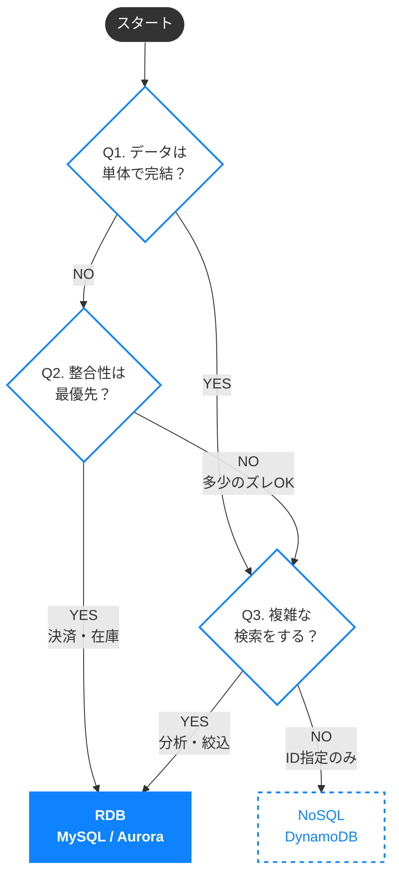

## 1.はじめに

こんにちは。今回は リレーショナルデータベース を用いた、大規模開発を見据えた設計思想の学習記録です。
私は普段、非IT系の事業会社（いわゆるJTC）にて「部署内DX」の推進役を担っており、現場の手元業務を即座に改善するためのPoCやツール活用をメインに行っております。
構築しているシステムでは、ほとんどの場合でNoSQLデータベース（DynamoDB）を採用しており、知識に偏りがあります。将来的にエンタープライズ水準のプロジェクトでも通用するアーキテクチャ設計や実装力を養いたいと考え、休暇を活用してインプットを行いました。本記事はその学習の記録です。

## 2.対象読者

- リレーショナルデータベースについて簡単に確認したい方
- 「とりあえず動く」データベースから、保守性の高い設計へステップアップしたい方

## 3.記事を読むメリット

- NoSQL（非リレーショナルデータベース）を中心に扱ってきたエンジニアが、RDBの設計思想を学ぶ際の「勘所」や「違い」を理解できる点。同じ境遇の方の一助になれば幸いです。

## 4. 学習の背景

これまでPoC開発において、私はほとんどの場合で Amazon DynamoDB を採用してきました。 理由はアーキテクチャへのこだわりではなく、
- 初期開発スピード: 開発メンバーが初学者中心だったため、SQLやリレーションの学習コストをかけず、「JSONをそのまま保存できる」ような手軽さが必要だった。
- 学習コストが低い: スプレッドシート＋α 程度の感覚で扱えるため、インフラ構築やスキーマ設計に時間を割く必要がなかった。

という本音に尽きます。
スピード感を維持しつつ手軽な構築ができることは、初学者中心のチームにとって強力な武器でした。

実際、この選択は間違っていなかったとRDBを学んでいる今でも思っています。 構築したシステムはIoTデバイスのモニタリングが主目的であり、単純な状態（State）の読み書きにおいては、DynamoDBの持つ高いスケーラビリティと可用性、そしてKey-Value型のデータ構造が完璧にフィットしていたからです。

しかし、運用が安定し、システムが成長するにつれて、一つの危機感が芽生え始めました。

「このままでは、いつか詰む」

[AWSの公式ドキュメント](https://aws.amazon.com/jp/compare/the-difference-between-relational-and-non-relational-databases/)にもあるように、データの「関係性（リレーション）」が複雑化し、柔軟なクエリやデータ分析が求められるフェーズに入った時、NoSQLデータベース一辺倒の知識では太刀打ちできません。
「今はこれでいい」から脱却し、リレーショナルデータベース（RDB）を武器として扱えるようになること。それが、エンジニアとしての生存戦略に不可欠だと痛感したのです。
本記事は、そんな「NoSQL育ち」の私が、RDBの世界へ足を踏み入れ学び直した記録です。

## 5.そもそもリレーショナルデータベースとは

まず、私がよく使うDynamoDBですが
マネジメントコンソールのビジュアルからはスプレッドシート構造をイメージしがちですが、使うほどより柔軟な実態を感じています。
- 列（Column）の自由さ：1行目は「日付・ID」しか書いていなかったのに、100行目から急に「気温・湿度・備考」という列を勝手に書き足しても怒られることはない
- セルの深さ（ネスト）： 1つのセルの中に、ネストした表やJSONオブジェクト`({"sensor_1": 20, "sensor_2": 25})`を丸ごと詰め込むことができる
つまり、 **「1行1行が独立していて、ルールは行ごとに決められる」** のがDynamoDBだと感じています。

一方でRDBはというと

https://cloud.google.com/learn/what-is-a-relational-database?hl=ja

[Google Cloudの解説](https://cloud.google.com/learn/what-is-a-relational-database?hl=ja)にも、リレーショナルデータベース（RDB）を **「事前定義された関係でデータを整理する情報の集まり」** と定義しているように
- 列（Column）は法律: 初期段階でIDと名前と年齢の3列だけと定義したら、列を書き足すことは許されない
- セルは単一の値: 原則として、1つのセルには1つの値しか入れられません。詰め込まず、行を分けて保存するのが作法
つまり、 **「表全体に共通のルールが適用される」** のがRDBだと感じました。

一見使い勝手が悪く見えるが、複数のテーブルに分けてリレーションを持たせることで以下のようなメリットが得られる
例えば、商品管理をしているデータベースがあり、「商品Aの名前が変わった」という事態が発生したケース
- DynamoDBの場合: データの中に直接 `{ product: "旧商品名" }` と書いてある行が1万件あったら、1万回書き換える必要がある
- RDBの場合: たった1行の修正で修正完了する

この **「情報の重複をなくして、一箇所の変更で全てに反映させる」考え方を正規化** と呼びます。
RDBへの入門とは、データを「1枚の巨大なシートに詰め込む」ことから、「適切なシートに分割してリンクさせる」ことへ、脳内の整理整頓ルールを切り替える作業なのだと感じました。

## 6.具体的なユースケースと選択肢

具体的にはどのようなケースでRDBを使用するのか。生成AIの助けをもらいながら私なりの解釈を交えながら選定しました。

### 6.1.NoSQL (DynamoDB) が適しているケース

| ケース | 概要・データ例 | データ特性 | なぜNoSQLか |
|---|---|---|---|
| **IoT植物モニタリング** | センサーデータをひたすら蓄積し、直近の状態を確認する。 例: `Timestamp`, `Temp`, `Humidity` | データ同士に関連性がない（独立している）。 更新はほぼなく、新規追加がメイン。 | 書き込み負荷が高く、読み取りは「最新」や「特定時点」のピンポイント取得で済む |
| **ショッピングカート** | 「今、カゴに何が入っているか」を一時的に管理。 例: `SessionID`, `UserID`, `CartItems(商品IDと個数のJSON)`, , `UpdatedAt` | IDさえあれば中身を丸ごと取得できる。 商品詳細情報は、取得後にアプリケーション（FE/BE）側で紐付ける方が効率的。 データ構造がネストした階層的なJSON。 | Key指定でValue（カート全体）を一発で読み書きするKVSの特性が、パフォーマンスを最大化する |

### 6.2.RDB が適しているケース

| ケース | 概要・データ例 | データ特性 | なぜRDBか |
|---|---|---|---|
| **ECサイトの受発注** | 「誰が・何を・いつ」買ったかを記録し、在庫連動させる。 例: `Users`(ID, 名前, 住所), `Products`(ID, 商品名, 単価, 現在在庫), `Orders`(ID, UserID, ProductID, 購入数, ステータス) | データ同士が強く依存（ユーザー消失＝履歴崩壊）。 整合性が最重要。 | トランザクション機能により、注文確定と在庫減少の矛盾（不整合）を絶対に防げる |
| **社員・部署管理** | 組織構造（階層）があり、名称変更が頻繁。 例: `Departments`(ID, 部署名, 親部署ID), `Employees`(ID, 名前, 所属部署ID, 役職ID) | 部署名変更などが全社員に即座に反映される必要がある。 複雑な条件検索が多い。 | 正規化により、マスタデータの1行変更で全データに反映可能。SQLで柔軟な検索ができる |

### 6.3.データベースタイプ選定フロー

上記のユースケースを踏まえ、データベース選定のフローは以下のようになると考えられます

※ 単体で完結 とは
例：スーパーでの買い物（レシート明細 vs クレカ明細）
- 単体で完結の例：レシート明細では、購入品、金額、個数、場所、日時、合計金額がわかる。
- 単体で未完結の例：クレカ明細では、場所、日時、合計金額のみがわかり、詳細はレシートを照らし合わせる必要がある。

## 7.正規化

データベースを作るうえで重要な「正規化」について、教科書通りの手順で具体化します。
正規化とは、一言で言えば「データの重複をなくし、矛盾が起きないように整理整頓すること」で
「毎回手書きしていた領収書の宛名や商品情報を、台帳（マスタ）から番号だけで呼び出せるようにする作業」だと感じます

参照：
https://cloud.google.com/discover/what-is-database-normalization?hl=ja
https://learn.microsoft.com/ja-jp/office/troubleshoot/access/database-normalization-description

### 7.1.元となるデータ (非正規形)

| 注文ID | 注文日 | ユーザー名 | ユーザーEmail | 商品 | 単価 | 個数 |
| --- | --- | --- | --- | --- | --- | --- |
| 001 | 2025/1/1 | 田中太郎 | tanaka@ex.com | りんご, みかん | 100, 50 | 2, 5 |
| 002 | 2025/1/2 | 佐藤花子 | sato@ex.com | バナナ | 200 | 1 |

### 7.2.第1正規形 (1NF) : 1つのセルには1つの値

-  1つのセルに複数の値を入れず、1行1行に分割して「きれいな表」にします。

| 注文ID (PK) | 商品ID (PK) | 注文日 | ユーザー名 | ユーザーEmail | 商品名 | 単価 | 個数 |
| --- | --- | --- | --- | --- | --- | --- | --- |
| 001 | A | 2025/1/1 | 田中太郎 | tanaka@ex.com | りんご | 100 | 2 |
| 001 | B | 2025/1/1 | 田中太郎 | tanaka@ex.com | みかん | 50 | 5 |
| 002 | C | 2025/1/2 | 佐藤花子 | sato@ex.com | バナナ | 200 | 1 |

### 7.3.第2正規形 (2NF) : 主キーの一部にしか依存しないものを別テーブルへ

ここでは、**「複合キー（注文ID + 商品ID）」** が主キーになっている
しかし、よく見ると
- 商品名・単価 は、「商品ID」さえ分かれば決まる（つまり注文IDが何だろうと商品名と単価には影響がない）
- 注文日・ユーザー情報 は、「注文ID」さえ分かれば決まる（実際、注文IDに追従してユーザーが決定されるわけではないが現時点ではここまで）

このように、「キーの片方だけで値が決まってしまう項目」を別のテーブルに切り出す
残った「個数」は、「どの注文」で「どの商品」を買ったかによって決まるため、元の場所に残る

注文
| 注文ID (PK) | 注文日 | ユーザー名 | ユーザーEmail |
| --- | --- | --- | --- |
| 001 | 2025/1/1 | 田中太郎 | tanaka@ex.com |
| 002 | 2025/1/2 | 佐藤花子 | sato@ex.com |

商品
| 商品ID (PK) | 商品名 | 単価 |
| --- | --- | --- |
| A | りんご | 100 |
| B | みかん | 50 |
| C | バナナ | 200 |

注文明細
| 注文ID (PK) | 商品ID(PK) | 個数 |
| --- | --- | --- |
| 001 | A | 2 |
| 001 | B | 5 |
| 002 | C | 1 |

※1: 交差テーブルとは
https://zenn.dev/seven_901/articles/0316b7cce4e390

### 7.4.第3正規形 (3NF) : キー以外に依存しているものを別テーブルへ

第2正規形の「注文テーブル」を見ると「ユーザー名」と「ユーザーEmail」が気になる点である
これらは「注文ID」に紐付いているが、本質的には **「ユーザーそのもの」** に紐付く情報
もし田中さんが100回注文したら、100回「田中太郎, tanaka@ex.com」と記録することになる。これではEmail変更時に全ての過去データを修正する必要が出てしまう。

そこで、「キー（注文ID）以外の項目（ユーザー）によって決まる項目」をさらに別テーブルに切り出し

注文
| 注文ID (PK) | 注文日 | ユーザーID (FK) |
| --- | --- | --- |
| 001 | 2025/1/1 | u_001 |
| 002 | 2025/1/2 | u_002 |

ユーザー
| ユーザーID (PK) | ユーザー名 | ユーザーEmail |
| --- | --- | --- |
| u_001 |  田中太郎 | tanaka@ex.com |
| u_002 |  佐藤花子 | sato@ex.com |

商品
| 商品ID (PK) | 商品名 | 単価 |
| --- | --- | --- |
| A | りんご | 100 |
| B | みかん | 50 |
| C | バナナ | 200 |

注文明細
| 注文ID (PK) | 商品ID(PK)| 個数 |
| --- | --- | --- |
| 001 | A | 2 |
| 001 | B | 5 |
| 002 | C | 1 |

## 8. AWSでのRDB選択肢：Amazon RDSとAurora

参照：
https://docs.aws.amazon.com/ja_jp/AmazonRDS/latest/UserGuide/Welcome.html

設計思想を学んだところで、実際にAWS上でRDBを動かすためのサービスについても触れておく

### マネージドサービス (Amazon RDS) の活用
自前でEC2インスタンスにデータベースをインストールして管理するのは、バックアップやパッチ適用などの運用コストが高くなる。そのため、AWSが提供するマネージドサービスである Amazon RDS (Relational Database Service) を利用するのが一般的である

### Amazon Aurora の推奨

参照：
https://docs.aws.amazon.com/ja_jp/AmazonRDS/latest/AuroraUserGuide/CHAP_AuroraOverview.html

RDSの中でも、特にAWS環境で推奨されるのが **Amazon Aurora** である
- 高いパフォーマンスと可用性: MySQLやPostgreSQLと互換性を持ちながら、クラウドネイティブに再設計されており、従来の数倍のパフォーマンスを発揮
- サーバーレス (Aurora Serverless v2): DynamoDBのように、負荷に合わせて自動的に容量をスケーリングする機能も備わっている。「リソース管理をあまり気にしたくない」というNoSQLユーザーにとっても親しみやすい選択肢である

## 9. おわりに：設計から実装へ

本記事では、NoSQL（DynamoDB）中心の開発からRDBの世界へ踏み出すための「設計思想」や「正規化」について整理しました。
RDBは「窮屈なルール」ではなく、「データを守り、活用するための整理整頓術」であることを理解しながら進めることができました

ただし、頭の中で理解した「正規化」や「リレーション」が、実際のクエリでどのように機能するのか。
それを体感して初めて、RDBを武器にできたと言えるでしょう。

次回は 「実装編」 として、以下の内容をまとめた記事を作成する予定です

- AWS Aurora (PostgreSQL互換) の構築: 実際にクラウド上にDBを立ち上げる
- DBeaverなどのクライアントツール接続: 開発環境を整える
- SQL実践: 定義したテーブルを作成し、データを投入・検索してみる

「とりあえず動く」から「意図して動かす」エンジニアを目指して、引き続き学習を進めていきましょう。
